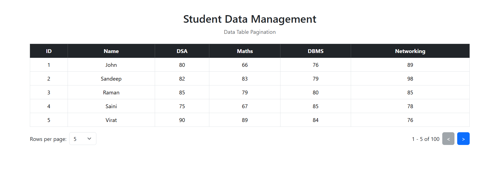

# Student Data Pagination

Student Data Pagination is a simple React project that displays student information in a table with pagination.

All student data is stored in a single `db.json` file and is fetched using JSON Server.

## Features

- Display all student data in a table
- Store all student data in one `db.json` file
- Fetch student data using JSON Server
- Pagination system
- Display 5, 25, or 50 rows per page
- Previous and Next buttons
- Display total number of students
- Bootstrap table design
- Simple and easy-to-use interface

## Technologies Used

- React.js
- JavaScript
- Bootstrap
- JSON Server
- HTML
- CSS

## Project Structure

student-pagination/
│
├── src/
│   ├── App.jsx
│   ├── main.jsx
│   └── ...
│
├── db.json
├── package.json
├── package-lock.json
└── README.md

## Database

All student data is stored in one `db.json` file.

Each student contains:

- ID
- Name
- DSA Marks
- Maths Marks
- DBMS Marks
- Networking Marks

The JSON Server API is:

http://localhost:3000/students

## Pagination

The project displays 5 students per page by default.

The user can select:

- 5 rows
- 25 rows
- 50 rows

The Previous and Next buttons are used to move between pages.

For example:

1 - 5 of 100

This means that students from 1 to 5 are currently displayed out of 100 students.

## API

The project uses JSON Server to get student data.

API Method:

GET

API URL:

http://localhost:3000/students

The API gets all student records from the `db.json` file.

## React Concepts Used

This project uses the following React concepts:

### useState

`useState` is used to store:

- Student data
- Current page
- Number of rows per page

### useEffect

`useEffect` is used to fetch student data from the JSON Server when the component loads.

### fetch()

The `fetch()` method is used to get student data from the API.

### slice()

The `slice()` method is used to display only the required students for the current page.

## Pagination Logic

The project calculates the first and last index of the data according to the current page and selected rows.

Example:

If 5 rows are selected and the current page is 2:

1 - 5 of 100

becomes:

6 - 10 of 100

## Output Photos

## Conclusion

This project provides a simple way to display and manage student data using React and JSON Server. It also demonstrates how pagination can be implemented in a React application.